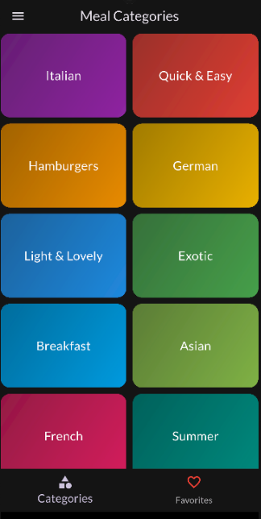
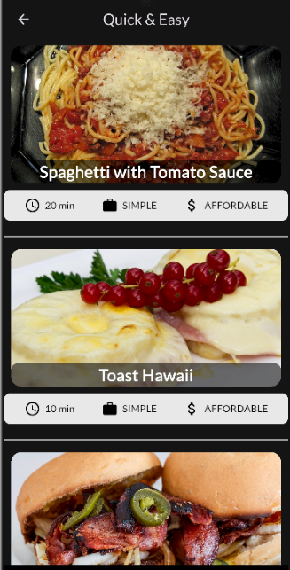
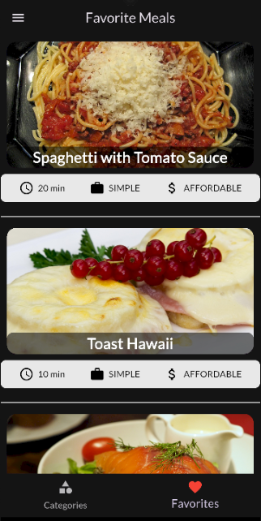
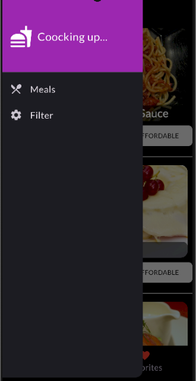

# Meal App
- **[Youtube Link](https://www.youtube.com/watch?v=GwlpSdydZyY)**
- **[LinkedIn Link](https://www.linkedin.com/posts/ramadan-mohamed-31624a220_flutter-hive-cubit-activity-7357404755247169537-10Ms?utm_source=share&utm_medium=member_desktop&rcm=ACoAADeQoUIBl2vxR13kgtVEp1n7BYjgYZuNzrI)**


A beautiful and user-friendly meal discovery application built with Flutter. Browse recipes, save your favorites, and enjoy a smooth, animated interface.

This project is designed to showcase a clean architecture using the BLoC pattern for state management and Hive for local data persistence.

## Features

- **Browse & Discover:** Explore a wide variety of meal categories.
- **Recipe Details:** View detailed information for each meal, including ingredients and preparation steps.
- **Favorites:** Save your favorite meals for quick and easy access.
- **Offline Access:** Your favorite meals are stored locally on your device using Hive, so you can access them even without an internet connection.
- **Clean UI:** A modern and intuitive user interface with smooth animations.
- **State Management:** Built with `flutter_bloc` for predictable and scalable state management.

## Screenshots

### Category View


### Meal Details View


### Favorites View

### Drawer View


## Getting Started

To get a local copy up and running, follow these simple steps.

### Prerequisites

Make sure you have the Flutter SDK installed on your machine.
- [Flutter Installation Guide](https://flutter.dev/docs/get-started/install)

### Installation

1. Clone the repo:
   ```sh
   git clone https://github.com/RamadanMohamed11/meal_app.git
   ```
2. Navigate to the project directory:
   ```sh
   cd meal_app
   ```
3. Install dependencies:
   ```sh
   flutter pub get
   ```
4. Run the app:
   ```sh
   flutter run
   ```

## Built With

- **[Flutter](https://flutter.dev/)** - The UI toolkit for building beautiful, natively compiled applications.
- **[Dart](https://dart.dev/)** - The programming language used.
- **[flutter_bloc](https://pub.dev/packages/flutter_bloc)** - For state management.
- **[Hive](https://pub.dev/packages/hive)** - A lightweight and fast key-value database for local storage.
- **[Google Fonts](https://pub.dev/packages/google_fonts)** - For custom fonts.
- **[Flutter Staggered Animations](https://pub.dev/packages/flutter_staggered_animations)** - For beautiful list animations.